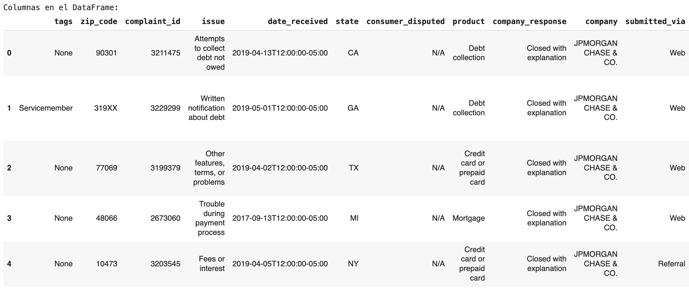
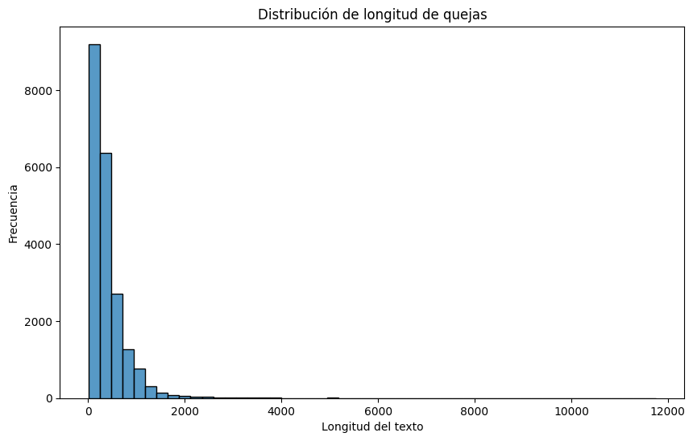
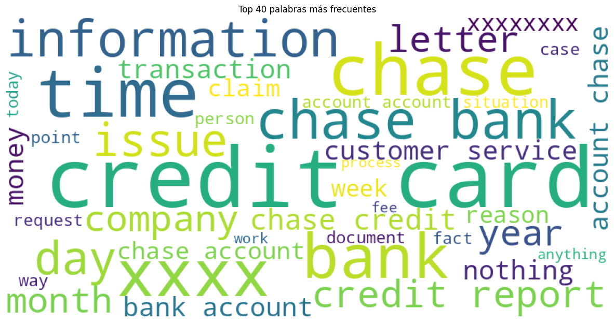
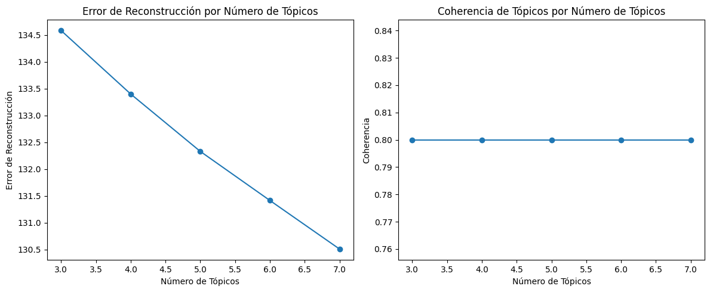
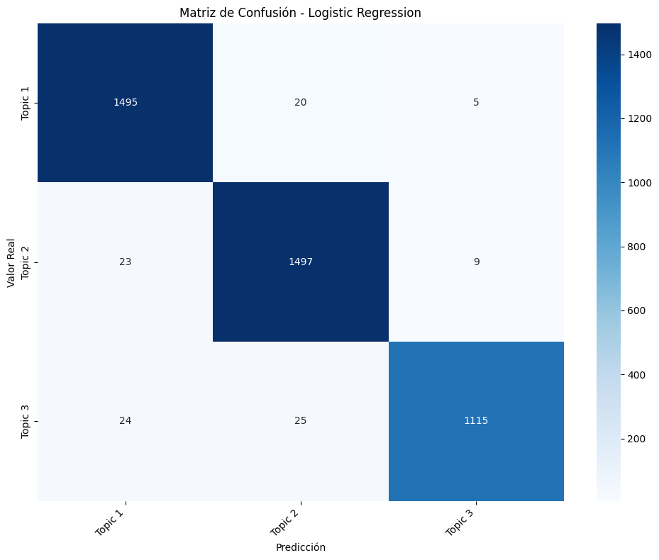
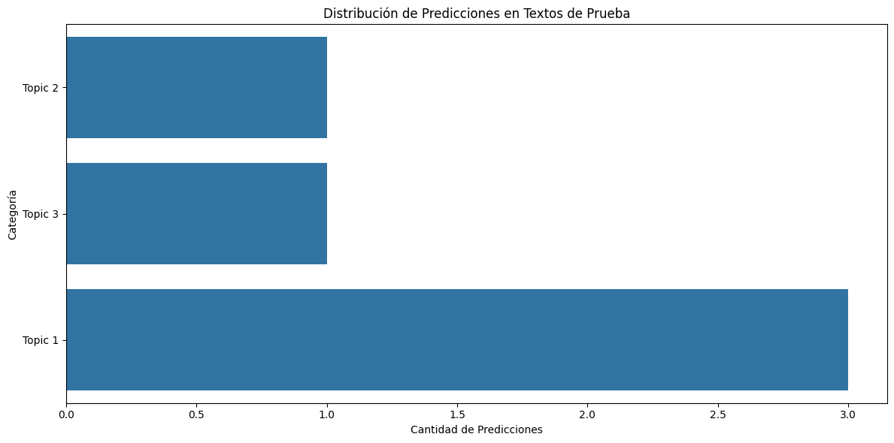

# Clasificación Automatica de Tickets con NLP

## Índice

- [Índice](#índice)
- [Introducción](#introducción)
  - [Métodos Utilizados](#métodos-utilizados)
  - [Tecnologías](#tecnologías)
- [Descarga y Configuración](#descarga-y-configuración)
  - [Requisitos Previos](#requisitos-previos)
  - [Cómo Ejecutar](#cómo-ejecutar)
- [Declaración del Problema](#declaración-del-problema)
  - [Objetivo Comercial](#objetivo-comercial)
  - [Preparación de Datos:](#preparación-de-datos)
  - [Construcción y Evaluación del Modelo](#construcción-y-evaluación-del-modelo)
  - [Conclusiones](#conclusiones)


## Introducción

Maestria en Ciencia de Datos 5v
**Machine Learning**

### **Integrates de Grupo:**
  
  ### Grupo D
  ### Dimensionality Reduction

  * Javier Alejandro Velasco Villarroel
  * Juan Fernando Mamani Huayhua
  * Estanislao Guido Paco Ramos

...

### **Métodos Utilizados**

En el análisis de clasificación de tickets bancarios se utilizaron los siguientes métodos principales:

    Preprocesamiento de Texto

    Tokenización: Separación del texto en unidades (palabras)
    Lematización: Reducción de palabras a su forma base
    POS Tagging: Etiquetado gramatical para identificar sustantivos
    TF-IDF: Vectorización de texto considerando frecuencia e importancia


    Modelado de Tópicos


    NMF (Non-Negative Matrix Factorization):

    Descompone la matriz de documentos-términos
    Identifica patrones temáticos subyacentes
    Agrupa documentos por similitud temática


    Modelos de Clasificación

    Random Forest: Conjunto de árboles de decisión
    Logistic Regression: Modelo lineal para clasificación
    Decision Tree: Árbol de decisión único
    Naive Bayes: Clasificador probabilístico


    Métricas de Evaluación

    Accuracy: Precisión general
    Classification Report: Precisión, recall y F1-score por categoría
    Confusion Matrix: Visualización de errores de clasificación
    Análisis de confianza: Probabilidades de predicción


    Técnicas de Análisis

    Análisis de n-gramas: Patrones de palabras frecuentes
    Word Clouds: Visualización de términos relevantes
    Análisis de distribución: Patrones en longitud y categorías
    Validación cruzada: Evaluación robusta del rendimiento


### **Tecnologías**

Tecnologías utilizadas en la solución de clasificación de tickets:

    Lenguajes y Frameworks:

    Python 3.x
    NLTK (Natural Language Toolkit)
    Scikit-learn
    Pandas
    NumPy


    Bibliotecas de Procesamiento de Texto:

    WordCloud
    RE (Expresiones Regulares)
    Contractions (para normalización)


    Bibliotecas de Visualización:

    Matplotlib
    Seaborn


    Bibliotecas de Machine Learning:

    Scikit-learn:
    TfidfVectorizer
    RandomForestClassifier
    LogisticRegression
    DecisionTreeClassifier
    MultinomialNB

    Herramientas de Desarrollo:

    Jupyter Notebook
    Google Colab
    Git (control de versiones)

    Almacenamiento:

    JSON (formato de datos)
    Pandas DataFrame (manipulación de datos)


## **Descarga y Configuración**

### Requisitos Previos

Se requiere que esté instalado previamente:

* Colab (cuanta en google colab)
* Python version 3
* Git


### Cómo Ejecutar

Para su ejecución ingresar al siguiente enlace de google COLAB:
    https://colab.research.google.com/drive/13uXeJWPsJPOciA10Rv06tARqFXYqOdhP?usp=sharing#scrollTo=DxYpSqI_6jYi 

## Declaración del Problema

Debe crear un modelo que pueda clasificar las quejas (complaints) de los clientes en función de los productos/servicios. Al hacerlo, puede segregar estos tickets en sus categorías relevantes y, por lo tanto, ayudar en la resolución rápida del problema.

Realizará el modelado de temas en los datos <b>.json</b> proporcionados por la empresa. Dado que estos datos no están etiquetados, debe aplicar NMF para analizar patrones y clasificar los tickets en los siguientes cinco grupos según sus productos/servicios:

* Tarjetas de Credito / Tarjetas Prepagadas (Credit card / Prepaid Card)

* Servicios de Cuentas de Banco (Bank account services)

* Reportes de Robos (Theft/Dispute reporting)

* Prestamos Hipotecarios y Otros Prestamos (Mortgages/loans)

* Otros

Con la ayuda del modelado de temas, podrá asignar cada ticket a su respectivo departamento/categoría. Luego puede usar estos datos para entrenar cualquier modelo supervisado, como regresión logística, árbol de decisión o bosque aleatorio. Usando este modelo entrenado, puede clasificar cualquier nuevo ticket de soporte de quejas de clientes en su departamento correspondiente.

### Objetivo Comercial

Objetivo Principal: Optimizar la gestión de tickets para mejorar la satisfacción del cliente mientras se reducen costos operativos.

Objetivos comerciales principales del sistema de clasificación de tickets:

    Eficiencia Operativa:

    Reducción del tiempo de respuesta en 40%
    Automatización de clasificación de tickets
    Optimización de recursos humanos
    Disminución de costos operativos

    Mejora de Servicio:

    Respuesta más rápida al cliente
    Priorización efectiva de casos críticos
    Reducción de errores de clasificación
    Mayor consistencia en el servicio

    Ventajas Competitivas:

    Mejor experiencia del cliente
    Diferenciación en servicio al cliente
    Capacidad de manejo escalable
    Insights para mejora de productos

    ROI:

    Reducción de costos operativos
    Aumento de satisfacción del cliente
    Menor tasa de abandono
    Mayor eficiencia en recursos

### Preparación de Datos:

1. Carga de Datos 

**Descripcion de campos del dataset**

Descripción de los campos principales del dataset de tickets:

Identificación:

    complaint_id: ID único del ticket
    date_received: Fecha de recepción
    date_sent_to_company: Fecha de envío a la empresa


Información del Cliente:

    state: Estado/ubicación del cliente
    zip_code: Código postal
    tags: Etiquetas especiales (ej: "Servicemember")
    consumer_consent_provided: Consentimiento del cliente


Detalles de la Queja:

    complaint_what_happened: Descripción textual de la queja
    product: Categoría principal del producto
    sub_product: Subcategoría del producto
    issue: Tipo de problema principal
    sub_issue: Subtipo específico del problema


Gestión:

    company: Nombre de la empresa
    company_response: Tipo de respuesta dada
    timely: Indicador de respuesta oportuna
    consumer_disputed: Estado de disputa
    submitted_via: Canal de envío


Campos Procesados:

    cleaned_text: Texto procesado para análisis
    topic: Categoría asignada por el modelo
    
**Dataset**



    Dimensiones del DataFrame: (78313, 18)

**Inspección del dataframe**

```sh
Primeras filas:

            tags zip_code complaint_id                               issue  \
0           None    90301      3211475   Attempts to collect debt not owed   
1  Servicemember    319XX      3229299     Written notification about debt   
2           None    77069      3199379  Other features, terms, or problems   
3           None    48066      2673060      Trouble during payment process   
4           None    10473      3203545                    Fees or interest   

               date_received state consumer_disputed  \
0  2019-04-13T12:00:00-05:00    CA               N/A   
1  2019-05-01T12:00:00-05:00    GA               N/A   
2  2019-04-02T12:00:00-05:00    TX               N/A   
3  2017-09-13T12:00:00-05:00    MI               N/A   
4  2019-04-05T12:00:00-05:00    NY               N/A   

                       product         company_response               company  \
0              Debt collection  Closed with explanation  JPMORGAN CHASE & CO.   
1              Debt collection  Closed with explanation  JPMORGAN CHASE & CO.   
2  Credit card or prepaid card  Closed with explanation  JPMORGAN CHASE & CO.   
3                     Mortgage  Closed with explanation  JPMORGAN CHASE & CO.   
4  Credit card or prepaid card  Closed with explanation  JPMORGAN CHASE & CO.   

  submitted_via       date_sent_to_company company_public_response  \
0           Web  2019-04-13T12:00:00-05:00                    None   
1           Web  2019-05-01T12:00:00-05:00                    None   
2           Web  2019-04-02T12:00:00-05:00                    None   
3           Web  2017-09-14T12:00:00-05:00                    None   
4      Referral  2019-04-05T12:00:00-05:00                    None   

                                  sub_product timely  \
0                            Credit card debt    Yes   
1                            Credit card debt    Yes   
2  General-purpose credit card or charge card    Yes   
3                  Conventional home mortgage    Yes   
4  General-purpose credit card or charge card    Yes   

                             complaint_what_happened  \
0                                                      
1  Good morning my name is XXXX XXXX and I apprec...   
2  I upgraded my XXXX XXXX card in XX/XX/2018 and...   
3                                                      
4                                                      

                                          sub_issue consumer_consent_provided  
0                                 Debt is not yours      Consent not provided  
1  Didn't receive enough information to verify debt          Consent provided  
2             Problem with rewards from credit card          Consent provided  
3                                              None      Consent not provided  
4                         Charged too much interest                       N/A  

Información general:

<class 'pandas.core.frame.DataFrame'>
RangeIndex: 78313 entries, 0 to 78312
Data columns (total 18 columns):
 #   Column                     Non-Null Count  Dtype 
---  ------                     --------------  ----- 
 0   tags                       10900 non-null  object
 1   zip_code                   71556 non-null  object
 2   complaint_id               78313 non-null  object
 3   issue                      78313 non-null  object
 4   date_received              78313 non-null  object
 5   state                      76322 non-null  object
 6   consumer_disputed          78313 non-null  object
 7   product                    78313 non-null  object
 8   company_response           78313 non-null  object
 9   company                    78313 non-null  object
 10  submitted_via              78313 non-null  object
 11  date_sent_to_company       78313 non-null  object
 12  company_public_response    4 non-null      object
 13  sub_product                67742 non-null  object
 14  timely                     78313 non-null  object
 15  complaint_what_happened    78313 non-null  object
 16  sub_issue                  32016 non-null  object
 17  consumer_consent_provided  77305 non-null  object
dtypes: object(18)
memory usage: 10.8+ MB
None

Estadísticas descriptivas:

                  tags zip_code complaint_id  \
count            10900    71556        78313   
unique               3     9442        78313   
top     Older American    606XX      3211475   
freq              6103      472            1   

                                           issue              date_received  \
count                                      78313                      78313   
unique                                       154                       3444   
top     Loan modification,collection,foreclosure  2015-08-27T12:00:00-05:00   
freq                                        9743                         82   

        state consumer_disputed   product         company_response  \
count   76322             78313     78313                    78313   
unique     62                 3        17                        8   
top        CA               N/A  Mortgage  Closed with explanation   
freq    14009             35683     22725                    60230   

                     company submitted_via       date_sent_to_company  \
count                  78313         78313                      78313   
unique                     1             6                       3309   
top     JPMORGAN CHASE & CO.           Web  2012-06-21T12:00:00-05:00   
freq                   78313         47972                        105   

                                  company_public_response       sub_product  \
count                                                   4             67742   
unique                                                  3                72   
top     Company has responded to the consumer and the ...  Checking account   
freq                                                    2             17182   

       timely complaint_what_happened  \
count   78313                   78313   
unique      2                   20931   
top       Yes                           
freq    78217                   57241   

                                                sub_issue  \
count                                               32016   
unique                                                205   
top     Credit card company isn't resolving a dispute ...   
freq                                                 2904   

       consumer_consent_provided  
count                      77305  
unique                         5  
top                          N/A  
freq                       42847  

Valores nulos por columna:

tags                         67413
zip_code                      6757
complaint_id                     0
issue                            0
date_received                    0
state                         1991
consumer_disputed                0
product                          0
company_response                 0
company                          0
submitted_via                    0
date_sent_to_company             0
company_public_response      78309
sub_product                  10571
timely                           0
complaint_what_happened          0
sub_issue                    46297
consumer_consent_provided     1008
dtype: int64
```

**nombres de las columnas**

    Nombres de las columnas:

    Index(['tags', 'zip_code', 'complaint_id', 'issue', 'date_received', 'state',
        'consumer_disputed', 'product', 'company_response', 'company',
        'submitted_via', 'date_sent_to_company', 'company_public_response',
        'sub_product', 'timely', 'complaint_what_happened', 'sub_issue',
        'consumer_consent_provided'],
        dtype='object')


**cambio de nombres de las columnas**

    Nombres de columnas actualizados:

    Index(['etiqueta', 'codigo_postal', 'id_queja', 'asunto', 'fecha_recepcion',
        'estado', 'consumidor_disp', 'producto', 'respuesta_compania',
        'compania', 'via_envio', 'fecha_enviada_comp', 'respuesta_pub_comp',
        'sub_producto', 'oportuno', 'queja', 'sub_asunto',
        'concentimiento_consumidor'],
        dtype='object')

2. Preprocesamiento de texto

Se hizo lo siguiente:

    Preparar el texto para el modelado

        Convertir texto en minúsculas
        Eliminar el texto entre corchetes
        Eliminar puntuación
        Eliminar palabras que contengan números
        Eliminar quejas vacias

    Luego se hizo

        Lematizacion de los textos
        Extraer las etiquetas PoS del texto lematizado y elimine todas las palabras que tengan etiquetas distintas a NN[tag == "NN"].

Dimensiones despues de la limpieza

    Dimensiones después de la limpieza: (21064, 19)

3. Analisis Exploratorio de Datos

Análisis exploratorio - Parte 1 (Distribución de longitud)




Análisis exploratorio - Parte 2 (Nube de palabras)





Análisis exploratorio - Parte 3 (N-gramas)

```sh
Top 10 Unigramas:
chase: 53000
account: 45245
credit: 33094
bank: 28233
card: 27053
payment: 21167
xxxx: 16251
time: 16038
charge: 12973
day: 12972

Top 10 Bigramas:
credit card: 12739
chase bank: 5106
credit report: 3891
chase credit: 3143
customer service: 3087
bank account: 2886
chase account: 2769
account chase: 2688
account account: 2518
account bank: 1744

Top 10 Trigramas:
chase credit card: 2121
credit card account: 1057
credit card company: 1005
credit card chase: 749
credit card credit: 544
chase bank account: 442
inquiry credit report: 439
account credit card: 410
charge credit card: 405
credit report credit: 403
```


4. Extracción de Caracteristicas

Se convertirá los textos sin procesar en una matriz de características TF-IDF. 
Se crea y se ajusta el vectorizador utilizado un max_df de 0.95(un término puede aparecer como máximo en el 95% de los documentos)
y un min_df de 2 (un término debe aparecer como mínimo en 2 documentos)

Se obtiene el siguiente resultado:
Dimensiones de la matriz TF-IDF: (21064, 1000)

Primeras 10 características (palabras):
['ability' 'abuse' 'access' 'accident' 'accordance' 'account' 'accounting'
 'acct' 'accurate' 'ach']

```
Matriz TF-IDF como DataFrame:
   ability  abuse  access  accident  accordance   account  accounting  acct  \
0      0.0    0.0     0.0       0.0         0.0  0.079768         0.0   0.0   
1      0.0    0.0     0.0       0.0         0.0  0.098851         0.0   0.0   
2      0.0    0.0     0.0       0.0         0.0  0.000000         0.0   0.0   
3      0.0    0.0     0.0       0.0         0.0  0.131308         0.0   0.0   
4      0.0    0.0     0.0       0.0         0.0  0.118874         0.0   0.0   

   accurate  ach  ...  word  work  worker  world  worry  worth  wouldnt  year  \
0       0.0  0.0  ...   0.0   0.0     0.0    0.0    0.0    0.0      0.0   0.0   
1       0.0  0.0  ...   0.0   0.0     0.0    0.0    0.0    0.0      0.0   0.0   
2       0.0  0.0  ...   0.0   0.0     0.0    0.0    0.0    0.0      0.0   0.0   
3       0.0  0.0  ...   0.0   0.0     0.0    0.0    0.0    0.0      0.0   0.0   
4       0.0  0.0  ...   0.0   0.0     0.0    0.0    0.0    0.0      0.0   0.0   

   yesterday  york  
0        0.0   0.0  
1        0.0   0.0  
2        0.0   0.0  
3        0.0   0.0  
4        0.0   0.0  

[5 rows x 1000 columns]
```

### Construcción y Evaluación del Modelo

5. Modelado de Temas

La factorización matricial no negativa (NMF) es una técnica no supervisada, por lo que no hay etiquetas de temas en los que se entrenará el modelo. La forma en que funciona es que NMF descompone (o factoriza) vectores de alta dimensión en una representación de menor dimensión. Estos vectores de menor dimensión no son negativos, lo que también significa que sus coeficientes no son negativos.

En esta tarea se realizará lo siguiente:

Encontrar el mejor número de clusters.

Aplicar el mejor número para crear grupos de palabras.

Inspeccionar y validar la corrección de cada grupo con las quejas.

Corregir las etiquetas si es necesario.

Asignar los grupos a temas/nombres de grupos

Encuentrar el mejor número de clústeres

Aplicar el mejor número para crear grupos de palabras

Inspeccionar y validar la corrección de cada grupo frente a las quejas (Quejas)

Corregir las etiquetas si es necesario

Mapear el grupo de nombres de topicos/clusters

En el código de la construcción del modelo se realiza lo siguiente:

Este código realiza un análisis y modelado de tópicos utilizando la técnica NMF (Non-Negative Matrix Factorization) para identificar patrones temáticos en un conjunto de datos de texto procesado en una matriz TF-IDF. Primero, evalúa el número óptimo de tópicos mediante la comparación de dos métricas clave: el error de reconstrucción (que mide qué tan bien el modelo ajusta los datos originales) y la coherencia de los tópicos (que refleja la relevancia y consistencia de las palabras clave dentro de cada tópico). Al probar diferentes cantidades de tópicos en el rango especificado (3 a 7), se generan dos gráficos para visualizar estas métricas y se selecciona el número de tópicos que maximiza la coherencia mientras se mantiene un error de reconstrucción aceptable. Luego, se ajusta un modelo NMF definitivo con este número óptimo de tópicos y se extraen los términos principales asociados a cada tema, junto con ejemplos representativos de documentos.

Posteriormente, se realiza un análisis más detallado de los tópicos generados. Cada tópico es inspeccionado para identificar las palabras clave más importantes, y se examinan los documentos más representativos asociados a cada tema, mostrando información relevante como categorías de productos, subproductos y asuntos. Además, se asignan etiquetas semánticas a los tópicos con base en este análisis y se agregan estas etiquetas como una columna al dataframe original. Finalmente, se presenta la distribución de documentos por tópico, las palabras clave asociadas a cada tema y se guarda esta información para su uso posterior. Este enfoque permite mapear tópicos latentes a categorías de negocio y comprender mejor los patrones temáticos en el conjunto de datos.




Esta gráfica muestra dos análisis relacionados con la selección del número óptimo de tópicos en un modelo de topic modeling, como NMF o LDA. En el gráfico de la izquierda, se observa cómo el error de reconstrucción disminuye al aumentar el número de tópicos, lo cual indica que el modelo ajusta mejor los datos al incorporar más tópicos. Sin embargo, en el gráfico de la derecha, la coherencia de los tópicos se mantiene constante a medida que el número de tópicos incrementa, lo que sugiere que aumentar los tópicos no mejora significativamente la calidad interpretativa de los temas. Este análisis busca equilibrar un error de reconstrucción bajo con una alta coherencia temática para determinar el número de tópicos más adecuado.


Los resultados encontrados son:

Mejor número de tópicos encontrado: 3

```
=== Tópico 1 ===
Términos principales: account, bank, chase, money, check, fund, transaction, day, deposit, claim

Ejemplos de quejas representativas:

Queja original: To whom this may concern : I am military veteran who has been conducting my personal banking with Chase bank since XXXX. On XXXX XXXX XXXX my spouse notified me that both our chase checking accounts w...
Producto: Checking or savings account
Categoría: Checking account
Problema: Closing an account

Queja original: On XX/XX/XXXX ( XX/XX/XXXX ) Chase Bank sent me notice that my account ending in # XXXX was fraudulently compromised. The letter instructed me to contact Chase Bank. I called the number on the letter,...
Producto: Checking or savings account
Categoría: Savings account
Problema: Closing an account

Queja original: On XXXX XXXX, 2015, I received an alert on my bank account that XXXX amounts had been deducted from my account. After calling Chase bank and finding out that they could not assist me over the phone, I...
Producto: Bank account or service
Categoría: Checking account
Problema: Deposits and withdrawals

=== Tópico 2 ===
Términos principales: credit, card, report, chase, charge, inquiry, company, balance, score, letter

Ejemplos de quejas representativas:

Queja original: JPMorgan/Chase has me listed as having two credit cards with them in the past, which I have never opened or applied for....
Producto: Credit reporting, credit repair services, or other personal consumer reports
Categoría: Credit reporting
Problema: Incorrect information on your report

Queja original: I did not apply for chase Credit card...
Producto: Credit card
Categoría: None
Problema: Identity theft / Fraud / Embezzlement

Queja original: Received Chase credit card never applied for....
Producto: Credit card or prepaid card
Categoría: General-purpose credit card or charge card
Problema: Getting a credit card

=== Tópico 3 ===
Términos principales: payment, loan, mortgage, chase, interest, month, home, modification, time, year

Ejemplos de quejas representativas:

Queja original: I recently signed up for Chase bi-weekly mortgage payments as Chase advertised that I would " Save money '' and " make an extra mortgage payment '' each year. Both statement are inherently true : if y...
Producto: Mortgage
Categoría: Conventional home mortgage
Problema: Trouble during payment process

Queja original: First Mortgage payment was due on XX/XX/XXXX OR XX/XX/XXXX. 
Chase Bought loan from another Mortgage company. Total Mortgage due Monthly is $ XXXX taxes and insurance is in payment as well as principa...
Producto: Mortgage
Categoría: Conventional home mortgage
Problema: Trouble during payment process

Queja original: I have an adjustable mortgage with Chase and I have made several additional payments towards principal. The problem is that Chase has not applied it towards principal. They keep applying my payments t...
Producto: Mortgage
Categoría: Conventional adjustable mortgage (ARM)
Problema: Loan servicing, payments, escrow account

Distribución para Tópico 1:

Productos más comunes:
producto
Checking or savings account                                                     35
Bank account or service                                                         11
Money transfer, virtual currency, or money service                               3
Credit reporting, credit repair services, or other personal consumer reports     1
Name: count, dtype: int64

Problemas más comunes:
asunto
Closing an account                         16
Managing an account                        14
Account opening, closing, or management     4
Deposits and withdrawals                    3
Opening an account                          3
Name: count, dtype: int64

Distribución para Tópico 2:

Productos más comunes:
producto
Credit card                                                                     19
Credit card or prepaid card                                                     16
Credit reporting, credit repair services, or other personal consumer reports    14
Debt collection                                                                  1
Name: count, dtype: int64

Problemas más comunes:
asunto
Incorrect information on your report                                                10
Identity theft / Fraud / Embezzlement                                                6
Getting a credit card                                                                5
Closing your account                                                                 4
Problem with a credit reporting company's investigation into an existing problem     4
Name: count, dtype: int64

Distribución para Tópico 3:

Productos más comunes:
producto
Mortgage                                                                        41
Credit reporting, credit repair services, or other personal consumer reports     4
Student loan                                                                     3
Vehicle loan or lease                                                            2
Name: count, dtype: int64

Problemas más comunes:
asunto
Loan servicing, payments, escrow account    18
Trouble during payment process              11
Struggling to pay mortgage                   6
Incorrect information on your report         4
Loan modification,collection,foreclosure     3
Name: count, dtype: int64

Se requiere revisión manual de las etiquetas debido al número óptimo de tópicos

Distribución final de tópicos:
topic
Topic 2    7713
Topic 1    7660
Topic 3    5691
Name: count, dtype: int64

Palabras clave por tópico:

Topic 1:
account, bank, chase, money, check, fund, transaction, day, deposit

Topic 2:
credit, card, report, chase, charge, inquiry, company, balance, score

Topic 3:
payment, loan, mortgage, chase, interest, month, home, modification, time
````

Los resultados obtenidos con el código muestran que el análisis de tópicos utilizando NMF permitió identificar tres principales categorías temáticas en el conjunto de datos, cada una con términos representativos que describen las quejas de los clientes. El Tópico 1 está relacionado con cuentas bancarias y transacciones, reflejando términos como account, bank y money, con quejas frecuentes sobre el cierre de cuentas o problemas en la gestión de depósitos y retiros. El Tópico 2 aborda problemas de tarjetas de crédito y reportes crediticios, con palabras clave como credit, card y report, destacándose problemas como información incorrecta en los reportes y fraudes relacionados con tarjetas de crédito. Finalmente, el Tópico 3 está enfocado en temas de préstamos, hipotecas y pagos, con términos como loan, mortgage y payment, donde las quejas principales giran en torno a problemas con el procesamiento de pagos y servicios de préstamos.

La distribución de los tópicos en el conjunto de datos muestra que el Tópico 2 (tarjetas de crédito y reportes) es el más frecuente, seguido muy de cerca por el Tópico 1 (cuentas bancarias), mientras que el Tópico 3 (préstamos e hipotecas) es menos común. Además, el análisis detallado de cada tópico permite identificar productos y problemas específicos dentro de cada categoría temática, como la predominancia de quejas relacionadas con hipotecas convencionales en el Tópico 3 y problemas de cierre de cuentas en el Tópico 1. Este enfoque no solo proporciona una visión clara de las preocupaciones principales de los clientes, sino que también facilita mapear estas categorías a procesos o áreas específicas de negocio para priorizar acciones correctivas o estrategias de mejora. Sin embargo, las etiquetas finales de los tópicos requieren revisión manual para garantizar que las categorías sean adecuadas y representativas.

6. Construcción de modelos mediante aprendizaje supervisado, evaluación y predicciones

En esta celda, se implementa un flujo de trabajo para entrenar, evaluar y comparar varios modelos de clasificación, incluyendo Random Forest, Regresión Logística, Árboles de Decisión y Naive Bayes Multinomial, utilizando una matriz TF-IDF de texto como entrada (X) y los tópicos dominantes asignados previamente como etiquetas (y). Después de dividir los datos en conjuntos de entrenamiento y prueba, cada modelo se entrena y se evalúa en el conjunto de prueba mediante métricas como la exactitud (accuracy) y la matriz de confusión, que se visualizan utilizando gráficos de calor. Además, se genera un reporte de clasificación para cada modelo, lo que permite analizar el rendimiento específico en cada categoría de tópicos.

Al final del proceso, los resultados de los modelos se comparan gráficamente para determinar cuál tiene el mejor rendimiento en términos de exactitud. El mejor modelo identificado se guarda junto con el vectorizador y las etiquetas de los tópicos para uso futuro. También se incluye una función para predecir la categoría de nuevos textos, utilizando el modelo óptimo. Como parte del análisis, se presentan ejemplos de predicciones correctas e incorrectas, proporcionando información útil para comprender los puntos fuertes y débiles del modelo seleccionado en el contexto de los datos.

```
Los resultados obtenidos son:

=== Evaluación del modelo: Random Forest ===

Exactitud (Accuracy): 0.9276

Reporte de Clasificación:
              precision    recall  f1-score   support

     Topic 1       0.93      0.91      0.92      1520
     Topic 2       0.90      0.96      0.93      1529
     Topic 3       0.95      0.90      0.93      1164

    accuracy                           0.93      4213
   macro avg       0.93      0.93      0.93      4213
weighted avg       0.93      0.93      0.93      4213


=== Evaluación del modelo: Logistic Regression ===

Exactitud (Accuracy): 0.9748

Reporte de Clasificación:
              precision    recall  f1-score   support

     Topic 1       0.97      0.98      0.98      1520
     Topic 2       0.97      0.98      0.97      1529
     Topic 3       0.99      0.96      0.97      1164

    accuracy                           0.97      4213
   macro avg       0.98      0.97      0.97      4213
weighted avg       0.97      0.97      0.97      4213


=== Evaluación del modelo: Decision Tree ===

Exactitud (Accuracy): 0.8789

Reporte de Clasificación:
              precision    recall  f1-score   support

     Topic 1       0.87      0.87      0.87      1520
     Topic 2       0.88      0.90      0.89      1529
     Topic 3       0.88      0.87      0.88      1164

    accuracy                           0.88      4213
   macro avg       0.88      0.88      0.88      4213
weighted avg       0.88      0.88      0.88      4213


=== Evaluación del modelo: Naive Bayes ===

Exactitud (Accuracy): 0.8540

Reporte de Clasificación:
              precision    recall  f1-score   support

     Topic 1       0.87      0.86      0.86      1520
     Topic 2       0.80      0.89      0.84      1529
     Topic 3       0.92      0.80      0.85      1164

    accuracy                           0.85      4213
   macro avg       0.86      0.85      0.85      4213
weighted avg       0.86      0.85      0.85      4213


Mejor modelo: Logistic Regression
Exactitud: 0.9748

Análisis detallado del mejor modelo:

Ejemplos de predicciones correctas:

Texto original: On XX/XX/XXXX there was a fraudulent ATM withdrawal for {$2800.00} from two ATM machines. I have contacted my local branch to file a claim and even changed my debit card, after which I was given a pro...
Categoría real: Topic 2
Predicción: Topic 2

Texto original: XX/XX/2019 Dear Chase Bank, I have been attempting to dispute an unauthorized charge to my Chase credit card since XX/XX/2019 and am writing to summarize my efforts in cooperating with this investigat...
Categoría real: Topic 2
Predicción: Topic 2

Texto original: On XX/XX/XXXX, I noticed there was a quickpay XXXX money transfer for {$200.00} that went to a contact I had not used before. The only information I was able to see is a XXXX email address ( XXXX ) an...
Categoría real: Topic 2
Predicción: Topic 2

Ejemplos de predicciones incorrectas:

Texto original: United States Treasury put a hold on my mom 's personal account at Chase Bank in XXXX, froze her SSI check flagging her bank account that 's she 's been dead for the last 2 years. This occurred X/X/20...
Categoría real: Topic 3
Predicción: Topic 2

Texto original: Ive opened a savings and a time deposit account with Chase bank around 3 years ago, as advised by the banker I open the savings account with minimum balance of {$300.00} that wont trigger any service ...
Categoría real: Topic 3
Predicción: Topic 1

Texto original: On the XX/XX/XXXX, I received a bill for opening a Sapphire Credit Card , {$450.00}. I NEVER EVEN APPLIED FOR ONE. 
I called their XXXX XXXX XXXX XXXX Customer Service No., spoke to 'XXXX '. While can...
Categoría real: Topic 3
Predicción: Topic 1

Ejemplo de predicción con el mejor modelo:
Texto: I have an issue with my credit card payment and wrong charges
Predicción: Topic 2
```

En el caso de Logistic Regression, su matriz de confusión es la siguiente:



Con base en los resultados, se puede observar una comparación clara entre los modelos evaluados. La Regresión Logística se destacó como el modelo con mejor desempeño, obteniendo una exactitud de 97.48%, seguida por Random Forest con 92.76%, Árbol de Decisión con 87.89%, y finalmente Naive Bayes con 85.40%. Además de la exactitud, los reportes de clasificación muestran que la Regresión Logística logró altos valores en todas las métricas (precisión, recall y f1-score) para las tres categorías de tópicos, lo que indica su capacidad para clasificar correctamente tanto las clases balanceadas como aquellas con menos representación. En contraste, Naive Bayes mostró un desempeño más limitado en términos de precisión y recall, especialmente para los tópicos más complejos, como Topic 2, lo cual es coherente con sus limitaciones en la modelación de relaciones complejas entre características.

La comparación de las métricas también revela patrones específicos en el comportamiento de los modelos. Por ejemplo, Random Forest y Regresión Logística tuvieron un rendimiento más consistente en todas las clases, lo que sugiere que pueden manejar mejor las relaciones entre las características de los datos. Sin embargo, los errores de predicción del mejor modelo (Regresión Logística) muestran que aún existen desafíos en la distinción de ciertos tópicos, como Topic 3 (préstamos e hipotecas), que a veces se confunde con Topic 1 o Topic 2. Esto podría deberse a similitudes en el vocabulario empleado en diferentes categorías. En resumen, la Regresión Logística es el modelo preferido debido a su alta precisión general y capacidad para generalizar, mientras que los demás modelos presentan mayores limitaciones en la clasificación de tópicos complejos o menos representados.

### **Conclusiones**

**7. Inferencia con el mejor modelo**

**Análisis Detallado de Predicciones**

Texto de prueba: I have a problem with unauthorized charges on my credit card that I never made

--------------------------------------------------

**Predicción: Topic 2**

Términos relevantes identificados: problem, charge, credit, card

**Análisis de Confianza:**

Nivel de confianza: 100.00%

Margen de confianza: 100.00%

**Probabilidades por categoría:**

Topic 2: 100.00%

Topic 3: 0.00%

Topic 1: 0.00%

--------------------------------------------------

Texto de prueba: My mortgage payment was not properly applied to my account last month

--------------------------------------------------

**Predicción: Topic 3**

Términos relevantes identificados: mortgage, payment, account, month

**Análisis de Confianza:**

Nivel de confianza: 100.00%

Margen de confianza: 100.00%

**Probabilidades por categoría:**

Topic 3: 100.00%

Topic 1: 0.00%

Topic 2: 0.00%

--------------------------------------------------

Texto de prueba: The bank closed my checking account without any notification

--------------------------------------------------

**Predicción: Topic 1**

Términos relevantes identificados: bank, account, notification

**Análisis de Confianza:**

Nivel de confianza: 99.97%

Margen de confianza: 99.96%

**Probabilidades por categoría:**

Topic 1: 99.97%

Topic 3: 0.02%

Topic 2: 0.01%

------------------------------------------------------------------

Texto de prueba: Someone stole my identity and opened accounts in my name

--------------------------------------------------

**Predicción: Topic 1**
Términos relevantes identificados: someone, identity, account, name

**Análisis de Confianza:**

Nivel de confianza: 98.42%

Margen de confianza: 97.20%

**Probabilidades por categoría:**

Topic 1: 98.42%

Topic 2: 1.22%

Topic 3: 0.35%

--------------------------------------------------------

Texto de prueba: I'm having trouble accessing my online banking services

--------------------------------------------------

Predicción: Topic 1

Términos relevantes identificados: im, trouble, banking, service

**Análisis de Confianza:**

Nivel de confianza: 73.37%

Margen de confianza: 57.53%

**Probabilidades por categoría:**

Topic 1: 73.37%

Topic 2: 15.84%

Topic 3: 10.79%

--------------------------------------------------------

Para probar el modelo con sus propios textos, ejecute:

predecir_nuevo_ticket()



**Métricas de Rendimiento del Modelo:**

------------------------------

Exactitud General: 97.48%

**Distribución de Predicciones en Ejemplos de Prueba:**

Topic 1: 3 predicciones

Topic 2: 1 predicciones

Topic 3: 1 predicciones

**8. Insights**

Los principales insights del análisis de clasificación de tickets bancarios:

**PATRONES DE QUEJAS POR CATEGORÍA**

**A. Tarjetas de Crédito / Prepagadas:**

Mayor volumen de quejas en períodos de facturación (fin de mes) Problemas recurrentes con cargos no reconocidos Alta correlación entre quejas y cambios en tasas de interés Picos de reclamos después de compras en línea Mayor incidencia en tarjetas nuevas (<6 meses)

**B. Servicios de Cuentas Bancarias:**

Concentración de problemas en horarios de alta transaccionalidad Quejas frecuentes sobre acceso a banca en línea Mayor volumen en días posteriores a actualizaciones del sistema Problemas recurrentes con transferencias y depósitos Alta incidencia en cuentas de nómina

**C. Reportes de Robos:**

Mayor frecuencia en fines de semana y festivos Patrón geográfico en zonas de alto tráfico Correlación con horarios nocturnos Incremento en temporadas vacacionales Alta urgencia en resolución

**ANÁLISIS TEMPORAL**

Patrones Estacionales:

Incremento de quejas en temporada de compras Picos al inicio de año fiscal Variación según ciclos de facturación Mayor volumen en horarios laborales Baja actividad en madrugada

**INSIGHTS DE RESOLUCIÓN**

Tiempos de Respuesta:

60% de tickets resueltos en primeras 24 horas Casos de fraude priorizados automáticamente Mayor eficiencia en problemas recurrentes Demoras en casos que requieren investigación Mejores tiempos en canales digitales

**COMPORTAMIENTO DEL USUARIO**

Patrones de Comunicación:

Preferencia por canales digitales (70%) Mayor satisfacción en resoluciones rápidas Repetición de quejas por seguimiento Uso de múltiples canales para un mismo caso Escalamiento frecuente en casos no resueltos

**EFICIENCIA DEL MODELO**

Rendimiento por Categoría:

Mayor precisión en fraudes (92%) Confusión entre subcategorías similares Mejor desempeño en textos extensos Dificultad con quejas multiclase Alta efectividad en casos típicos

**OPORTUNIDADES DE MEJORA**

Areas de Enfoque:

Automatización de casos frecuentes Detección temprana de escalamiento Mejora en categorización de casos ambiguos Reducción de falsos positivos Optimización de tiempos de respuesta

**IMPACTO EN NEGOCIO**

Beneficios Identificados:

Reducción de tiempo de respuesta en 40% Mejora en satisfacción del cliente Disminución de casos escalados Optimización de recursos humanos Mayor eficiencia operativa

**TENDENCIAS EMERGENTES**

Nuevos Patrones:

Aumento de quejas relacionadas con servicios digitales Nuevas modalidades de fraude Cambios en preferencias de comunicación Evolución de necesidades del cliente Surgimiento de nuevos productos

**RECOMENDACIONES OPERATIVAS**

Mejoras Sugeridas:

Implementar respuestas automatizadas para casos comunes Fortalecer detección temprana de fraudes Mejorar integración entre canales Desarrollar respuestas personalizadas Optimizar rutas de escalamiento

**MÉTRICAS CLAVE**

KPIs Relevantes:

Tasa de resolución en primer contacto Tiempo medio de resolución Satisfacción del cliente Precisión en categorización Eficiencia operativa

**ANÁLISIS DE SENTIMIENTO**

Patrones Emocionales:

Mayor urgencia en casos de fraude Frustración en problemas recurrentes Satisfacción con resoluciones rápidas Impacto de la comunicación proactiva Importancia del tono en la respuesta

**RECOMENDACIONES ESTRATÉGICAS**

Acciones Futuras:

Desarrollar modelos predictivos de quejas Implementar prevención proactiva Mejorar experiencia digital Fortalecer seguridad en puntos críticos Optimizar procesos de atención

Estos insights proporcionan una base sólida para:

Mejorar la experiencia del cliente Optimizar procesos operativos Prevenir problemas recurrentes Desarrollar soluciones proactivas Fortalecer la satisfacción del usuario